# Taekwondo Web Application

>A Master Stephanos Taekwondo Web application manages student and inventory systems. It is designed with a main goal to help Master Stephanos to manage student, inventory and other related records. He can search with various conditions such as belt color, city, year and student name and so on. He can also keep the track of student's attendance, fees history, inventory, orders and suppliers systematically

## Table of contents
* [Technologies](#technologies)
* [Running the Application](#running-the-application)
* [Snapshot](#snapshots)
* [Contact](#contact)

## Technologies
* Web Framework - ASP.NET MVC C#
* Database - MS SQL Server
* Web Technologies - HTML5, CSS3, JavaScript, jQuery, Bootstrap
* IDE Tool - Microsoft Visual Studio

## Running the Application
* Step 1: Import the database back up file with .bak extension into MS SQL SERVER by clicking on Restore Database from file. Then, select this file and Database will be created.
* Step 2: Open the project in Visual Studio and connect it to the database by clicking on the Add Database Connection.
* Step 3: Once the database is connected, Click on View without debugging option, the Web Application will run on your localhost system.

## Snapshot
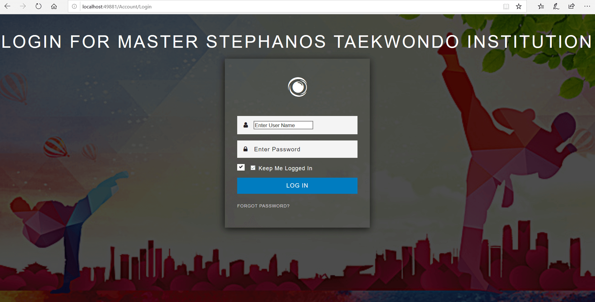 

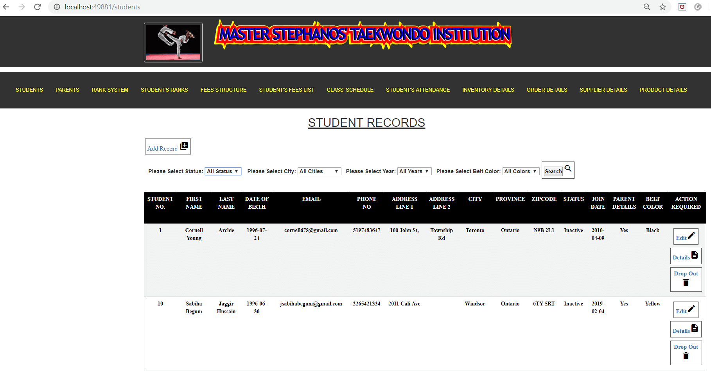
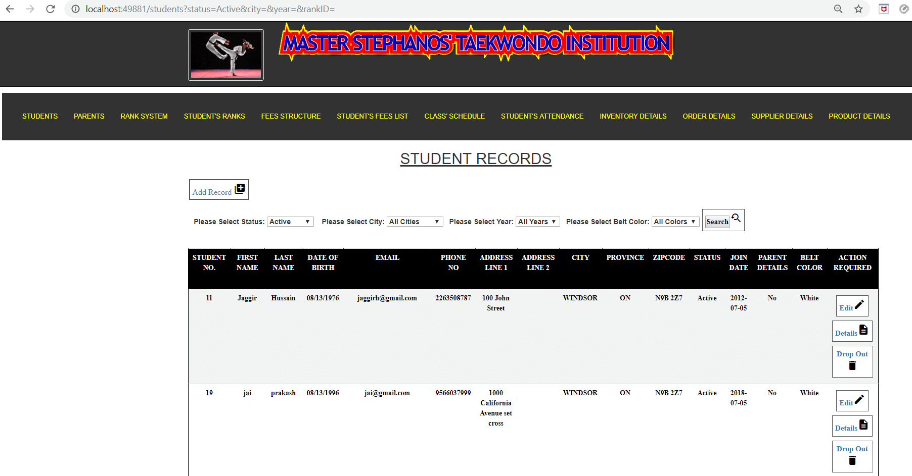
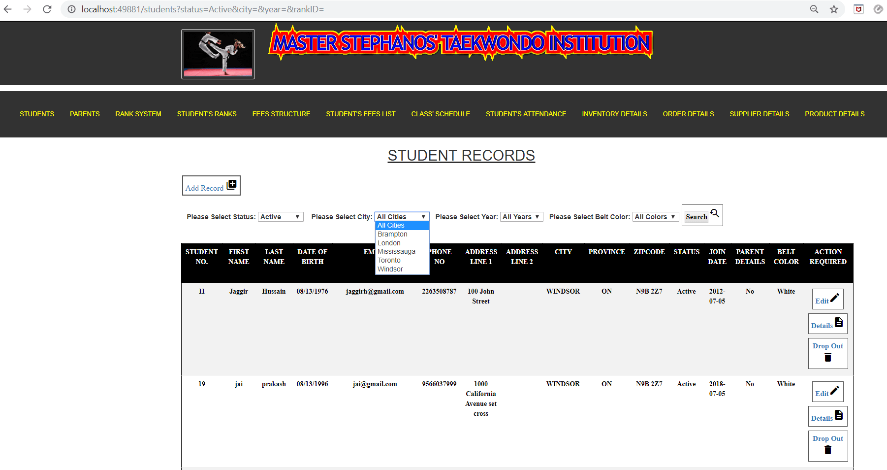
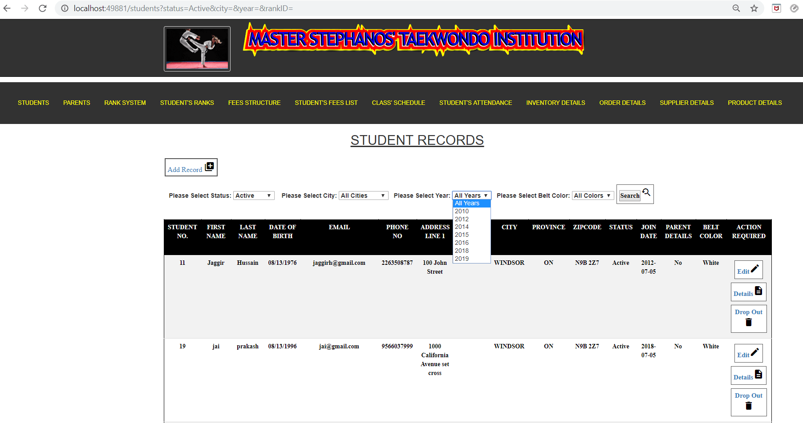
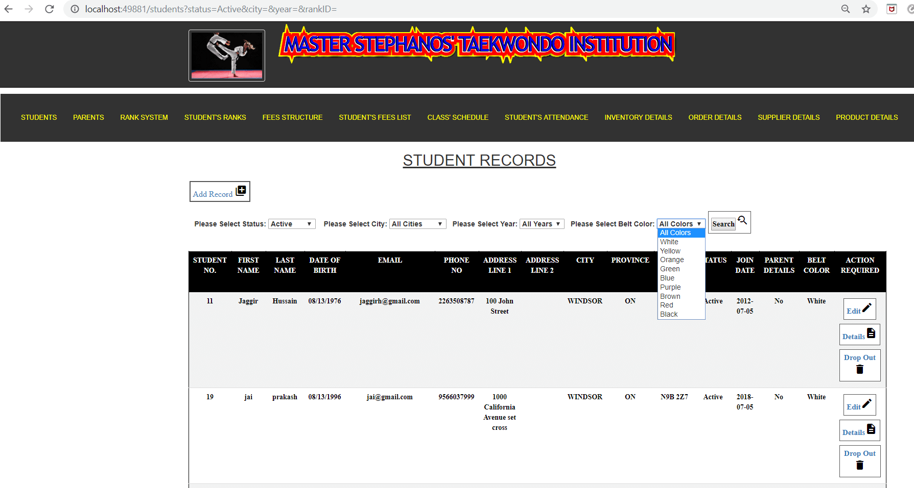
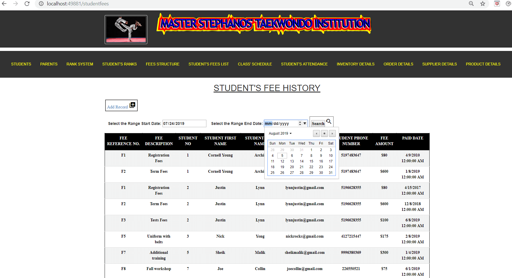
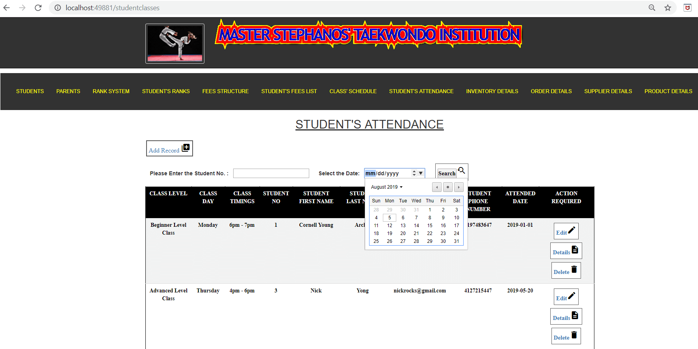
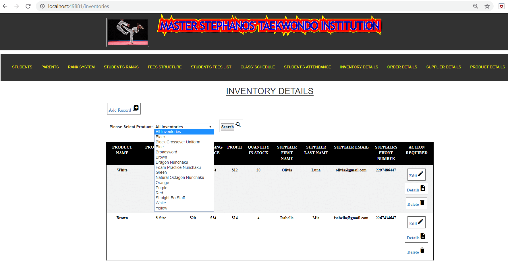
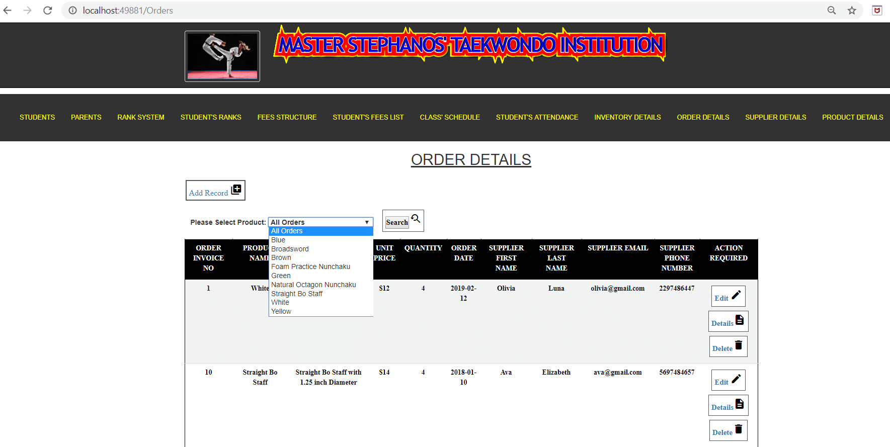
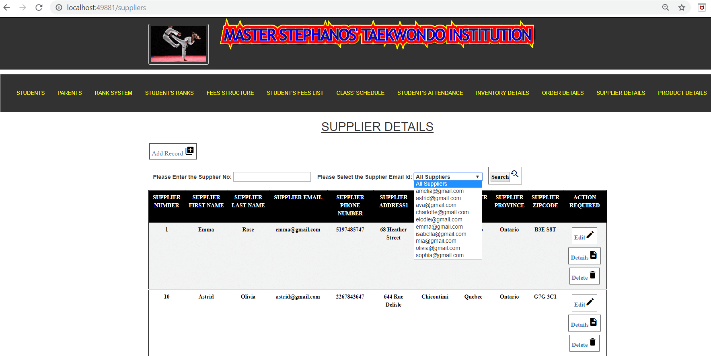
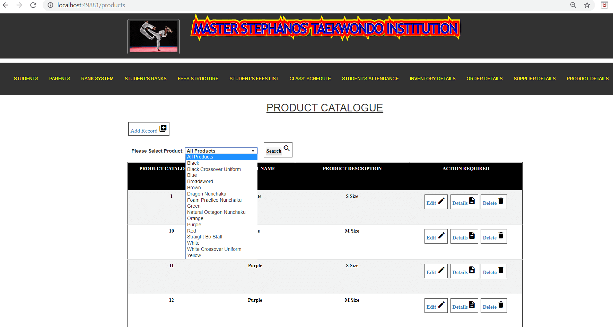

## Contact
[Hemanth Kumar Woraram](https://hemanthkumarw.com/) - feel free to contact me!
